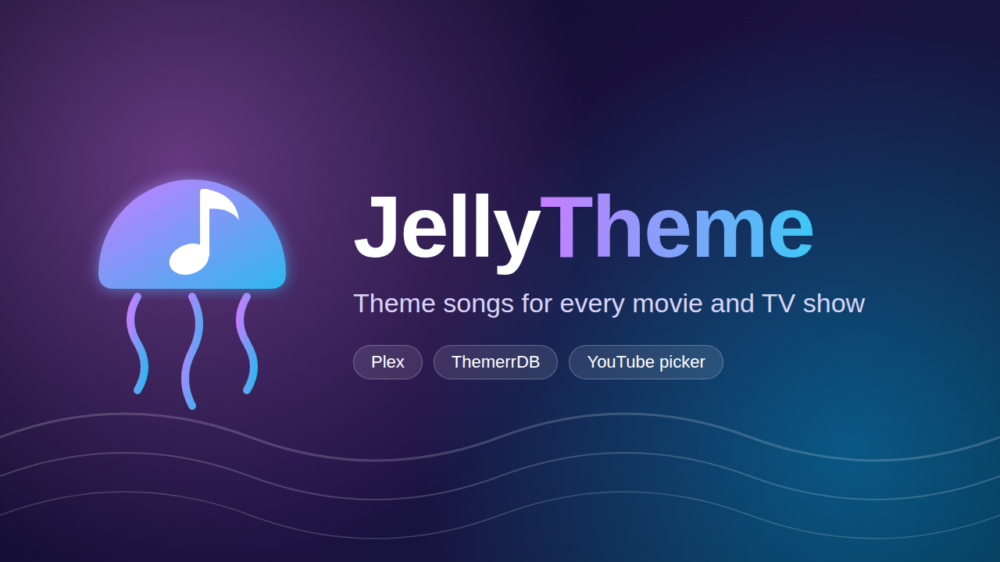

<p align="center">
  
</p>

# JellyTheme

**A Jellyfin plugin that adds theme songs to your movies and TV shows, with as little work from you as possible.**

Theme songs are the music that plays while you browse a movie or show in Jellyfin. Jellyfin plays them when it finds a `theme.mp3` (or similar) file in the item's folder, but it doesn't download them for you. JellyTheme does.

It fills themes automatically from two trusted sources, keeps doing that for everything you add later, and gives you a quick picker page for whatever is left.

## Contents

- [What it does](#what-it-does)
- [What it does not do](#what-it-does-not-do)
- [Requirements](#requirements)
- [Install from the Jellyfin catalog (recommended)](#install-from-the-jellyfin-catalog-recommended)
- [First run](#first-run)
- [Using the Missing themes page](#using-the-missing-themes-page)
- [Updates](#updates)
- [Be careful with](#be-careful-with)
- [Troubleshooting](#troubleshooting)
- [FAQ](#faq)
- [Manual install](#manual-install)
- [Uninstall](#uninstall)
- [For the maintainer: how releases work](#for-the-maintainer-how-releases-work)
- [Development](#development)
- [Credits](#credits)
- [License](#license)

## What it does

JellyTheme tries three sources, in this order, and stops at the first one that has a theme:

| # | Source | Covers | Needs | Saved as | Automatic? |
|---|---|---|---|---|---|
| 1 | **Plex** TV theme server | TV shows | TVDB id | `theme.mp3` | Yes |
| 2 | **ThemerrDB** (community-picked YouTube links) | Movies and TV shows | TMDB id | `theme.m4a` | Yes |
| 3 | **Missing themes page** (you pick from YouTube) | Anything left | Nothing | `theme.m4a` | No, you choose |

The automatic sources run:

- **Every day**, as the scheduled task **Download theme songs** (Dashboard > Scheduled Tasks > JellyTheme). You can also start it by hand there.
- **For every new movie or show**, as soon as Jellyfin has fetched its metadata. You don't have to wait for the daily run.

After a theme is saved, JellyTheme asks Jellyfin to refresh that item, so the theme plays right away without a full library scan.

The ids (TVDB, TMDB) come from Jellyfin's normal metadata. If your movies and shows show posters and descriptions, they almost certainly have these ids already.

## What it does not do

- **It never replaces a theme you already have.** Any `theme.*` file or `theme-music` folder means the item is skipped. To replace a theme, delete the file first.
- **No themes for movies that share a folder.** Jellyfin plays a folder's theme for every movie in it, so a theme there would play for all of them. Give each movie its own folder (for example `Movies/The Matrix (1999)/The Matrix (1999).mkv`) to get one.
- **No themes for episodes, seasons, music, books or other library types.** Only movies and shows.
- **No automatic YouTube guessing.** YouTube search only happens on the Missing themes page, and only you decide what gets saved. That keeps wrong songs out of your library.
- **No theme videos (backdrops).** Audio only.
- **No settings to configure.** It works out of the box.

## Requirements

- **Jellyfin 12.1 or newer.** JellyTheme is built for Jellyfin 12.1 and will not load on 10.x servers.
- **Write access to your media folders** for the Jellyfin server. Themes are saved next to your movies and shows.
- **Internet access** from the server to `tvthemes.plexapp.com`, `app.lizardbyte.dev`, `youtube.com` and `github.com`.

Nothing else. There is nothing to install besides the plugin itself: everything it needs ships inside the plugin.

## Install from the Jellyfin catalog (recommended)

You add the JellyTheme repository to Jellyfin once. After that, installing and updating works like any official plugin.

1. **Open the plugin repositories.** In Jellyfin, go to **Dashboard > Plugins** and open **Repositories**. In some Jellyfin versions this is the gear (settings) icon on the **Catalog** page, called **Manage repositories**.
2. **Add the repository.** Press **+** (Add) and fill in:
   - **Name:** `JellyTheme`
   - **URL:** `https://raw.githubusercontent.com/PeterSlijkhuis/JellyTheme/main/manifest.json`

   Save.
3. **Install the plugin.** Go to **Dashboard > Plugins > Catalog**. Find **JellyTheme** (under Metadata) and press **Install**.
4. **Restart Jellyfin.** Dashboard > **Restart** (or restart the container or service). Jellyfin only loads new plugins after a restart.
5. **Check it loaded.** Go to **Dashboard > Plugins > My Plugins**. JellyTheme should show as **Active**.

That's it. Continue with [First run](#first-run).

## First run

1. Go to **Dashboard > Scheduled Tasks**, find **JellyTheme > Download theme songs**, and press the play button.
   - On a large library the first run takes a while, because it checks every movie and show once. Later runs only look at items that still have no theme, so they are quick.
   - You can watch progress on the task, and see what happened in **Dashboard > Logs** (look for "Saved Plex theme" and "Saved ThemerrDB theme").
2. When it finishes, open **JellyTheme** in the dashboard menu to see what is still missing, and fill those in by hand (see below).
3. Make sure theme songs are turned on for your user: open your user settings, go to **Display**, and enable **Theme songs**. This is a per-user Jellyfin setting.

After that there is nothing you have to do. New movies and shows get themes on their own, and the daily task retries anything that failed earlier.

## Using the Missing themes page

1. Open **Dashboard**, then **JellyTheme** in the menu. Only administrators can open it.
2. The page lists every movie and show that can hold a theme but has none. Narrow it down with the **name filter** or the **Movies / Shows** selector. It shows 100 items at a time, so use the filter to reach the rest.
3. Press **Find themes** on an item. The search box is pre-filled with the title, the year, and "main theme" (movies) or "opening theme" (shows). If the results are wrong, edit the search and press **Find themes** again. Adding "soundtrack", "intro" or the composer's name often helps.
4. Press play on a result to listen. Previews stream through your Jellyfin server, so they work on any device where you can open the dashboard.
5. Press **Use this** on the right one. JellyTheme saves its audio as `theme.m4a` in that item's folder, the item disappears from the list, and the theme plays from then on.

Picked the wrong one? Delete `theme.m4a` from the item's folder. The item shows up in the list again on the next page load.

## Updates

JellyTheme updates itself with almost no work from anyone:

- **New YouTube fixes arrive on their own.** Most of the time YouTube downloads break, it is because YouTube changed something and the YoutubeExplode library needed a fix. Every day, JellyTheme's repository checks for a new YoutubeExplode version. When there is one, it builds, tests and publishes a new JellyTheme release automatically.
- **Jellyfin installs updates on its own.** Jellyfin's built-in **Update Plugins** scheduled task checks the repository and installs new versions. A restart is needed before the new version is active, as with any plugin update.

You can also update by hand: **Dashboard > Plugins > My Plugins > JellyTheme**, then pick the newest version.

## Be careful with

- **YouTube's terms.** Downloading audio from YouTube may be against YouTube's Terms of Service, and theme songs are copyrighted. Use JellyTheme only for your own personal library, and decide for yourself whether you're comfortable with it. Plex themes don't involve YouTube.
- **YouTube changes break downloads for a while.** When YouTube changes something, ThemerrDB downloads and the Missing themes page stop working until a fixed YoutubeExplode is released and the automatic update above picks it up. That usually takes days, not hours. Plex themes keep working the whole time. Watch the log for "Could not save theme" warnings.
- **Read-only media folders.** If your media is mounted read-only (for example a Docker volume with `:ro`), or the Jellyfin user can't write to it, saving fails and the log shows a permission error. Give Jellyfin write access to those folders.
- **What gets written.** JellyTheme only ever adds `theme.mp3` or `theme.m4a` to a movie or show folder. While downloading it briefly writes a hidden `.jellytheme.part` file next to it, and removes it when done. It never changes, moves or deletes anything else.
- **The Plex theme server is unofficial.** Plex doesn't document it for outside use, so it could change or disappear without notice.
- **Your access token appears in preview links.** A browser `<audio>` player can't send login headers, so preview links include your Jellyfin access token, the same way Jellyfin's own web player streams media. It can show up in reverse-proxy logs.
- **Nobody checks what you pick.** ThemerrDB entries are reviewed by its community; your picks on the Missing themes page are not.

## Troubleshooting

| Symptom | Likely cause and fix |
|---|---|
| JellyTheme doesn't appear in the Catalog | The repository URL is wrong, or the server can't reach `raw.githubusercontent.com`. Re-check the URL in Repositories. |
| Plugin installed but not listed as Active | Jellyfin wasn't restarted, or it runs a version older than 12.1. |
| Plugin shows "Not supported" or "Malfunctioned" | Jellyfin is older than 12.1, or the install was incomplete. Uninstall, restart, install again. |
| A show gets no theme | It has no TVDB or TMDB id (use **Identify** on it in Jellyfin), or neither Plex nor ThemerrDB has one. Use the Missing themes page. |
| A movie gets no theme | It shares a folder with other movies, has no TMDB id, or ThemerrDB has no entry. |
| A movie or show isn't on the Missing themes page | It already has a `theme.*` file or `theme-music` folder, or it's a movie in a shared folder. |
| "Search failed" or previews won't play | YouTube changed something, or the server can't reach YouTube. Wait for the automatic update, and check the log. |
| Theme saved but doesn't play | Check that **Theme songs** is on in your user's Display settings. Otherwise wait a minute for the refresh, or use **Refresh metadata** on the item. |
| Permission errors in the log | Jellyfin can't write to the media folder. See "Read-only media folders" above. |

## FAQ

**Will it overwrite themes I added myself?**
No. Any existing `theme.*` file or `theme-music` folder makes JellyTheme skip that item.

**Does it work with Docker?**
Yes. Install it from the catalog as above. Just make sure your media volumes are not mounted read-only.

**Why `theme.m4a` and not `theme.mp3` for YouTube themes?**
YouTube serves AAC audio. Saving it as-is (`.m4a`) avoids re-encoding, so there is no quality loss and no need for extra tools like ffmpeg. Jellyfin plays both.

**How much disk space do themes take?**
Usually 1 to 5 MB per theme.

**Can I use it on Jellyfin 10.10 or 10.11?**
No. It needs Jellyfin 12.1 or newer.

**How do I stop it downloading for a specific item?**
Put any file named `theme.something` in that folder (even an empty one), or a `theme-music` folder. JellyTheme then leaves it alone.

## Manual install

Only if you can't use the catalog:

1. Download the newest `jellytheme_<version>.zip` from [Releases](https://github.com/PeterSlijkhuis/JellyTheme/releases).
2. Find your Jellyfin plugins folder. It is inside Jellyfin's data folder (Dashboard shows the data path under **Paths**). Common locations:

   | Setup | Plugins folder |
   |---|---|
   | Linux (package) | `/var/lib/jellyfin/plugins` |
   | Docker (official image) | `/config/plugins` inside the container |
   | Docker (linuxserver.io image) | `/config/data/plugins` inside the container |
   | Windows | `%ProgramData%\Jellyfin\Server\plugins` |

3. Create a folder named `JellyTheme` in it, and unzip both files into it (`Jellyfin.Plugin.JellyTheme.dll` and `YoutubeExplode.dll`).
4. Restart Jellyfin.

Manual installs don't update automatically.

## Uninstall

Go to **Dashboard > Plugins > My Plugins > JellyTheme > Uninstall**, then restart Jellyfin. Themes that were already saved stay in your media folders and keep playing. To remove them too, delete the `theme.mp3` and `theme.m4a` files JellyTheme added.

## For the maintainer: how releases work

Releases are built and published by the **Release** workflow in GitHub Actions. You never have to build anything on your own computer.

**One-time setup**

1. **Make the repository public.** Jellyfin downloads `manifest.json` and the release files without logging in, so a private repository can't be installed from.
2. **Publish the first release:** go to the **Actions** tab > **Release** > **Run workflow**, enter a changelog line, and run it. This builds and tests the plugin, creates release `v1.0.0.0` with the zip attached, and adds it to `manifest.json`. From then on the catalog URL above works.

**Releasing a new version by hand**

After merging changes, run the **Release** workflow again with a short changelog. The version number goes up automatically (1.0.0.0, 1.0.1.0, ...).

**Automatic releases**

Every day the workflow checks NuGet for a newer YoutubeExplode. If there is one, it updates the project, runs the tests, and only if they pass publishes a release with the changelog "Update YoutubeExplode ...". If the tests or build fail, nothing is published and GitHub emails you about the failed run.

Two things to know:

- GitHub pauses scheduled workflows in repositories with no activity for 60 days. If that happens, GitHub emails you; re-enable it in the Actions tab with one click.
- A new major Jellyfin version (for example 13) needs a code update: bump the `Jellyfin.Controller` package in the project and `TARGET_ABI` in `.github/scripts/release.py`.

**Where things live**

| File | What it is |
|---|---|
| `manifest.json` | The repository file Jellyfin reads. Updated by the workflow; don't edit versions by hand. |
| `.github/workflows/release.yml` | The Release workflow. |
| `.github/scripts/release.py` | Version bumping, YoutubeExplode check, and manifest updates. |
| `assets/banner.png` | The catalog and README image. Its source is `assets/banner.html`. |

## Development

Requires the [.NET 10 SDK](https://dotnet.microsoft.com/download).

```sh
dotnet build
dotnet test
```

The tests use fake HTTP responses and never contact Plex, ThemerrDB or YouTube.

| Code | What it does |
|---|---|
| `ThemeService.cs` | Decides which items need a theme, tries the sources in order, and triggers the refresh |
| `PlexThemeDownloader.cs` | Plex TV theme lookup and download |
| `ThemerrDb.cs` | ThemerrDB lookup by TMDB id |
| `YouTubeAudio.cs` | YouTube search, preview stream and audio download |
| `ThemeFiles.cs` | Finding existing themes and writing new ones safely |
| `ThemeTask.cs` | The daily scheduled task |
| `NewItemListener.cs` | Handles new items as soon as their metadata arrives |
| `ThemePickerController.cs` and `Web/themepicker.html` | The Missing themes page |

## Credits

JellyTheme combines ideas from two existing plugins and builds on open data and libraries. No code was copied from the plugins below; JellyTheme is a separate implementation.

- **[Themerr-jellyfin](https://github.com/LizardByte/Themerr-jellyfin)** by LizardByte (AGPL-3.0). The idea of filling themes automatically from ThemerrDB comes from Themerr.
- **[ThemerrDB](https://github.com/LizardByte/ThemerrDB)** by LizardByte and its contributors. The community database of YouTube theme links that JellyTheme looks themes up in. Missing a theme? You can contribute it to ThemerrDB so everyone gets it.
- **[xThemeSong (Jellyfin.Plugin.AssignThemeSong)](https://github.com/kirtan3d/Jellyfin.Plugin.AssignThemeSong)** by kirtan3d. The idea of choosing a YouTube theme by hand per item comes from xThemeSong.
- **Plex** for the public TV theme server at `tvthemes.plexapp.com`. JellyTheme is not affiliated with or endorsed by Plex.
- **[YoutubeExplode](https://github.com/Tyrrrz/YoutubeExplode)** by Tyrrrz (MIT). Used for YouTube search and audio download. It ships inside the plugin.
- **[Jellyfin](https://jellyfin.org)** for the server and plugin API. JellyTheme is a community plugin, not an official Jellyfin project.

### What is new in JellyTheme

- Plex, ThemerrDB and manual picking in one plugin, tried in that order, so each item gets the most reliable theme available.
- Themes for new items as soon as their metadata arrives, plus an immediate refresh so they play right away.
- The Missing themes page: a filtered list of everything without a theme, with several YouTube results to listen to side by side before saving.
- Automatic releases when YoutubeExplode ships a fix, so YouTube breakage heals itself.
- Safe file handling: downloads go to a temporary file first, so a dropped connection never leaves a broken theme. Existing themes are never touched.

## License

JellyTheme is free software under the [GNU General Public License v3.0](LICENSE). You may use, change and share it, as long as anything you distribute that is based on it stays under the same license.
